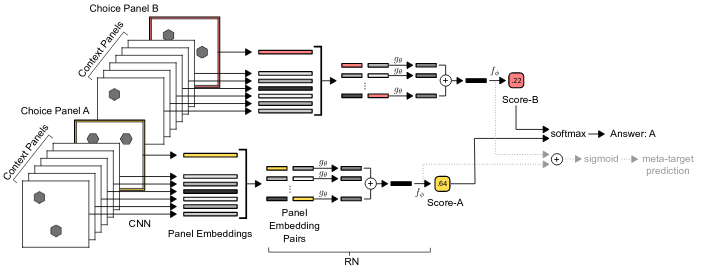

# Wild Relation Network
PyTorch implementation of Relation Network [1] and Wild Relation Network [2] for solving Raven's Progressive Matrices.

## Setup
```bash
$ pip install wild_relation_network
```

## Usage
Relation Network:
```python
import torch

from wild_relation_network import RelationNetwork

x = torch.rand(4, 8, 64)
rn = RelationNetwork(
    num_objects=8,
    object_size=64,
    out_size=32,
    use_object_triples=False,
    use_layer_norm=False
)
logits = rn(x)
logits  # torch.Tensor with shape (4, 32)
```

Wild Relation Network:
```python
import torch

from wild_relation_network import WReN

x = torch.rand(4, 16, 160, 160)
wren = WReN(
    num_channels=32,
    use_object_triples=False,
    use_layer_norm=False
)
logits = wren(x)
y_hat = logits.log_softmax(dim=-1)
y_hat  # torch.Tensor with shape (4, 8)
```

## Unit tests
```bash
$ python -m pytest tests
```

## Bibliography
[1] Santoro, Adam, et al. "A simple neural network module for relational reasoning." Advances in neural information processing systems. 2017.

[2] Santoro, Adam, et al. "Measuring abstract reasoning in neural networks." International Conference on Machine Learning. 2018.

## Citations
```bibtex
@inproceedings{santoro2017simple,
  title={A simple neural network module for relational reasoning},
  author={Santoro, Adam and Raposo, David and Barrett, David G and Malinowski, Mateusz and Pascanu, Razvan and Battaglia, Peter and Lillicrap, Timothy},
  booktitle={Advances in neural information processing systems},
  pages={4967--4976},
  year={2017}
}
```

```bibtex
@inproceedings{santoro2018measuring,
  title={Measuring abstract reasoning in neural networks},
  author={Santoro, Adam and Hill, Felix and Barrett, David and Morcos, Ari and Lillicrap, Timothy},
  booktitle={International Conference on Machine Learning},
  pages={4477--4486},
  year={2018}
}
```
